<p align="center">
  <a href="https://example.com/">
    
  </a>

  <h3 align="center">Fitfood</h3>

  <p align="center">
    Web e-commerce using SERN stack
    <br>
    <a href="https://www.fitfood.kd14.me/">Visit Website</a>

  </p>
</p>

## Table of contents

- [Website](#website)
- [API](#api)
- [This project is created using](#this-project-is-created-using)
- [Quick start](#quick-start)
- [Features](#bugs-and-feature-requests)
- [Testing](#testing)
- [Demo](#demo)
- [Creators](#creators)
- [Thanks](#thanks)

## Website

Website link: [https://www.fitfood.kd14.me/](https://www.fitfood.kd14.me/)

---

## API

- API link: [https://api.fitfood.kd14.me/api/](https://api.fitfood.kd14.me/api/)
- API documentation: [Documentation (Click to view)](./api-document.md)

---

## This project is created using

- Client:  ReactJS
- Server:  Nodejs,  ExpressJs
- Database:  Mysql,  Redis
- Deploy:  Ubuntu server 20.04

---

## Quick start

`Start with docker` you can get Fitfood E-commerce Webapp in minutes by running the following command:\
_Make sure you in fitfood_ecommerce folder and have docker, docker-compose_

- Production Environment:

  ```
   docker-compose -f docker-compose.prod.yml up --build
  ```

- Development Environment:

  ```
   docker-compose -f docker-compose.dev.yml up --build
  ```

---

## Features

- User

  - Login
  - Register
  - Verify Email
  - Forgot Password
  - My Account
    - Update info
    - View order history
    - Log out
  - Cart
  - Order products
  - Payment process

- Role-based authorization
  - Customer
  - Admin
- Products Management
  - CRUD
  - Filter, Order

---

## Testing

Command line:

```js
yarn test
```

---

## Demo

Explore my Fitfood website
|  |
| :---------------------------: |
| Homepage Screen |

| 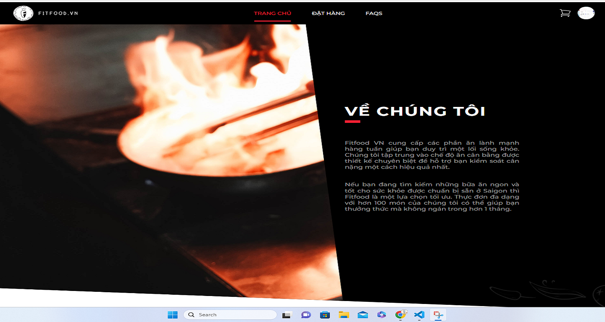 |
| :------------------------------------: |
|            Homepage Screen             |

| 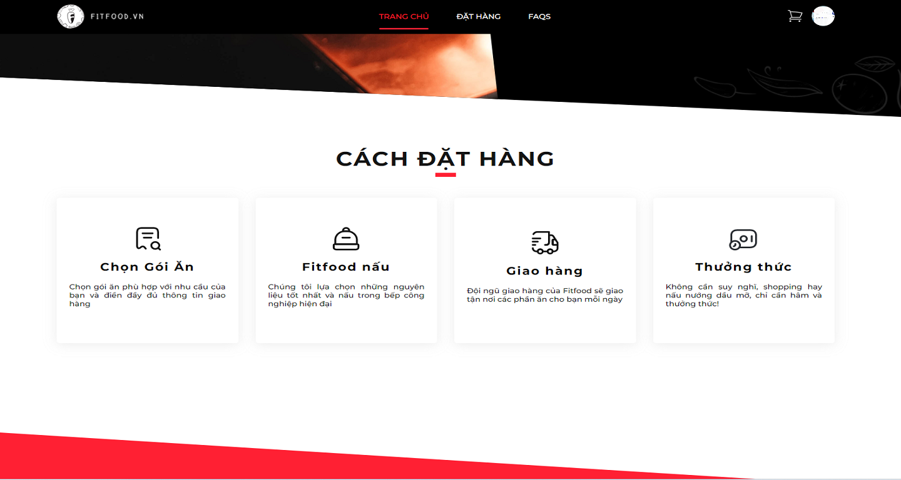 |
| :------------------------------------: |
|            Homepage Screen             |

|  |
| :------------------------------------: |
|            Homepage Screen             |

| 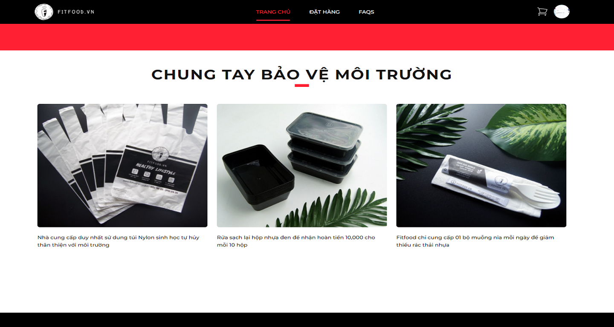 |
| :------------------------------------: |
|            Homepage Screen             |

| 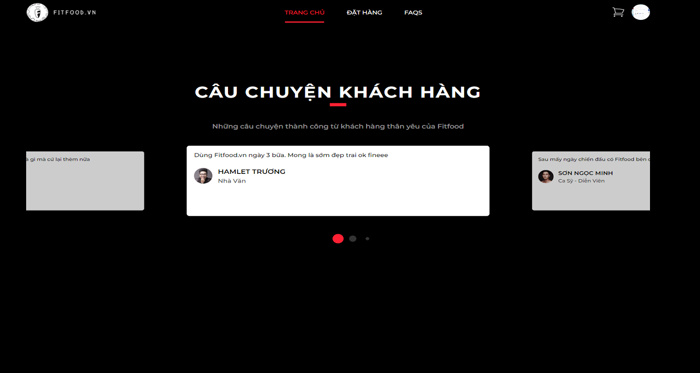 |
| :------------------------------------: |
|            Homepage Screen             |

| 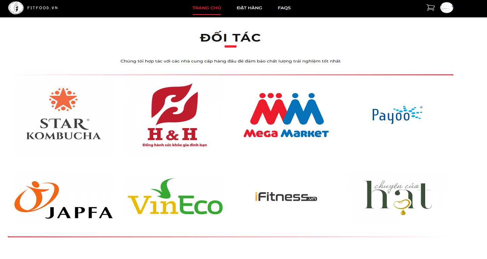 |
| :------------------------------------: |
|            Homepage Screen             |

View more ...

<details>
  <summary><code>Menu</code></summary>

| 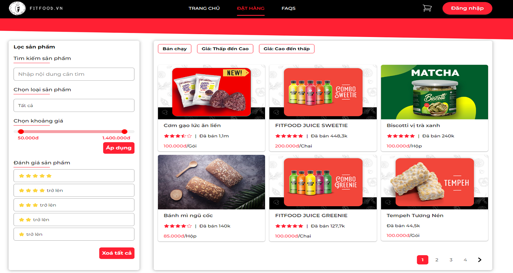 |
| :----------------------------------: |
|             Menu Screen              |

</details>

<details>
  <summary><code>Detail Page</code></summary>

| 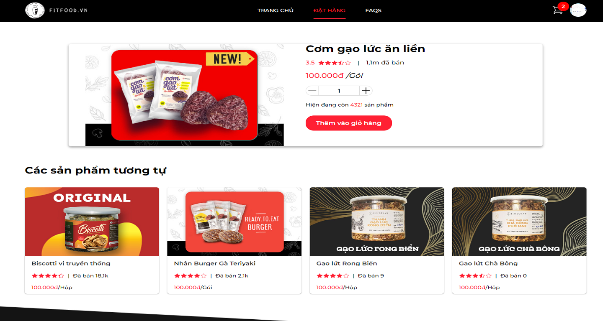 |
| :---------------------------------: |
|         Detail Page Screen          |

</details>

<details>
  <summary><code>Cart</code></summary>

| 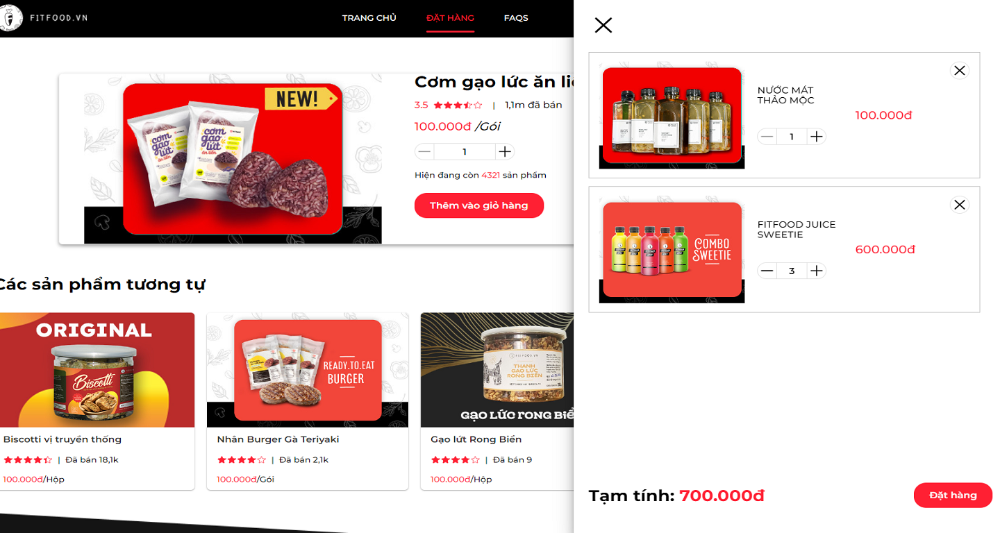 |
| :------------------------------: |
|               Cart               |

</details>

<details>
  <summary><code>Payment</code></summary>

| 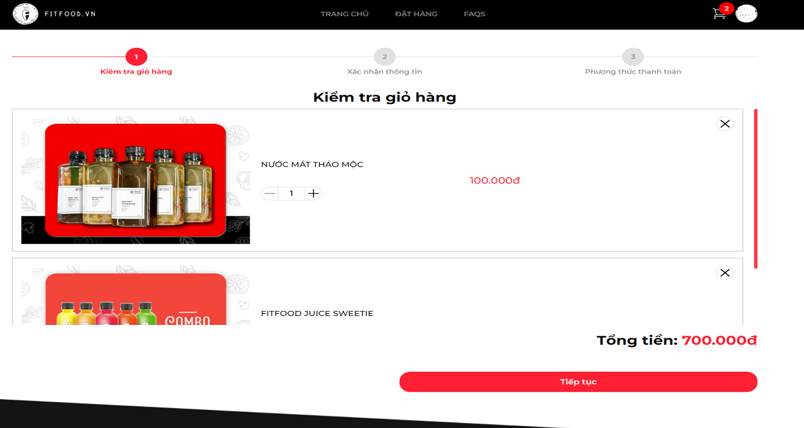 |
| :-----------------------------------: |
|        Payment Screen - Step 1        |

| 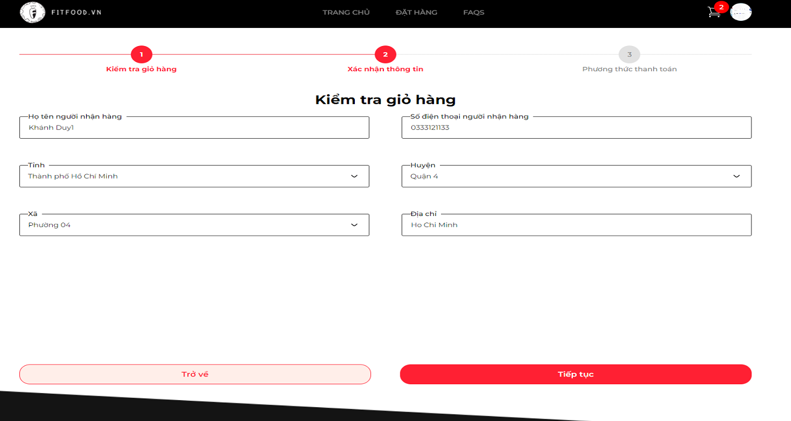 |
| :-----------------------------------: |
|        Payment Screen - Step 2        |

| 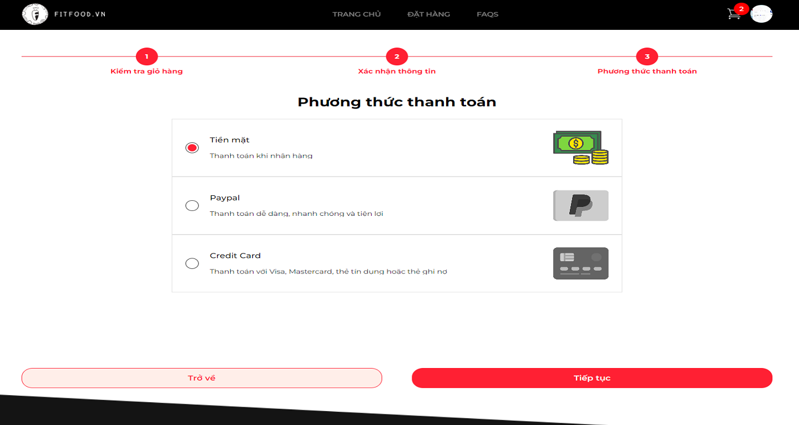 |
| :-----------------------------------: |
|        Payment Screen - Step 3        |

</details>

<details>
  <summary><code>Order History</code></summary>

| 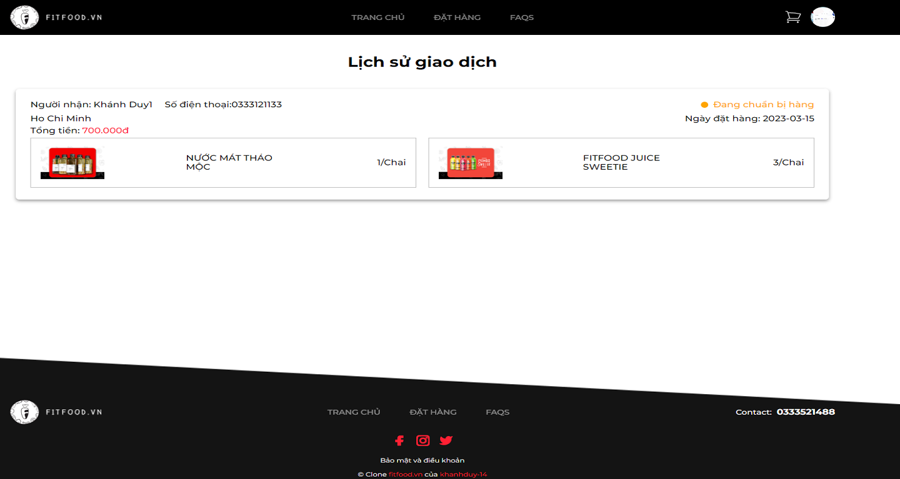 |
| :-----------------------------------------: |
|            Order History Screen             |

</details>

<details>
  <summary><code>Login</code></summary>

| 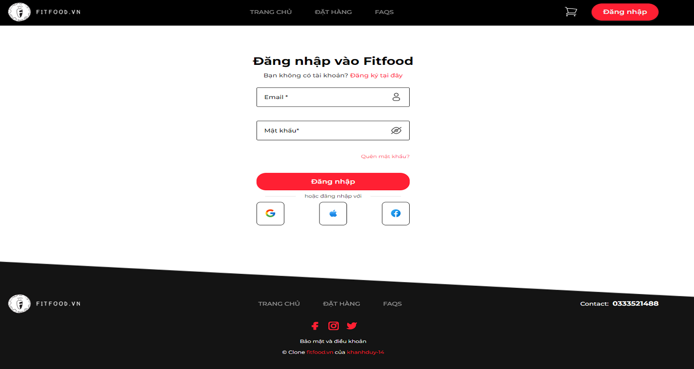 |
| :-------------------------------: |
|           Login Screen            |

</details>

<details>
  <summary><code>Register</code></summary>

| 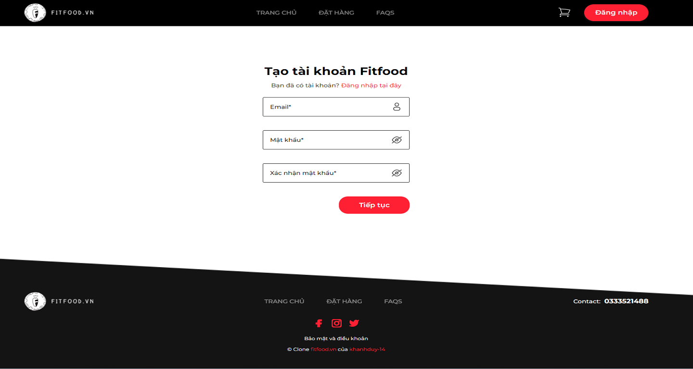 |
| :----------------------------------: |
|             Login Screen             |

</details>

<details>
  <summary><code>Verify Email</code></summary>

| 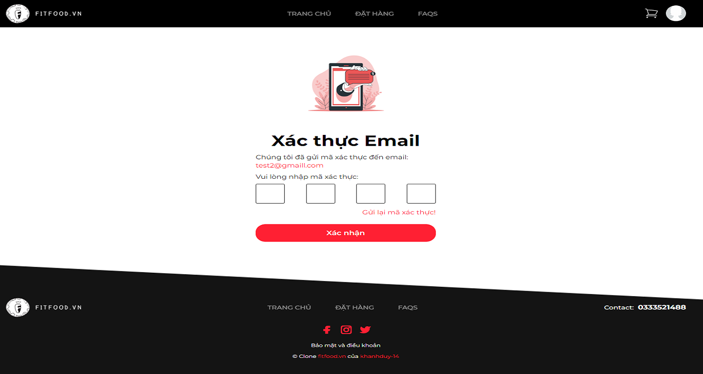 | 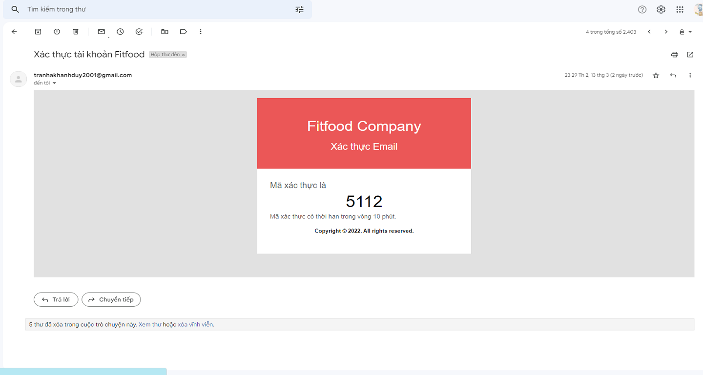 |
| :-------------------------------------: | :---------------------------------------------: |
|           Verify email screen           |              Verify email template              |

</details>

<details>
  <summary><code>My Account</code></summary>

| 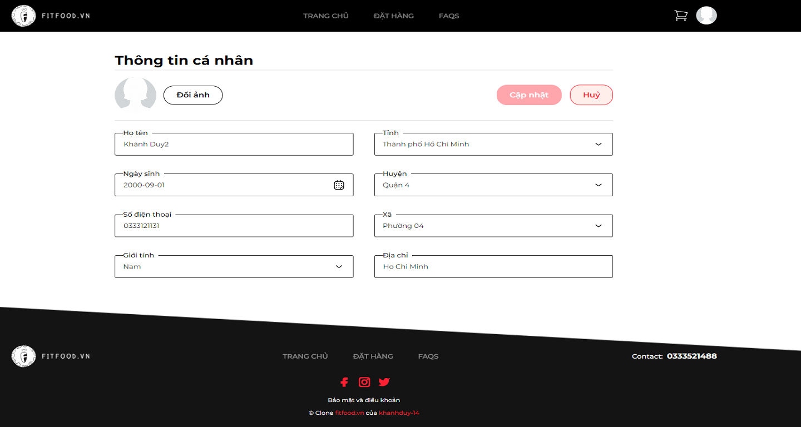 |
| :-----------------------------------: |
|           My Account Screen           |

</details>

<details>
  <summary><code>Products Management</code></summary>

| 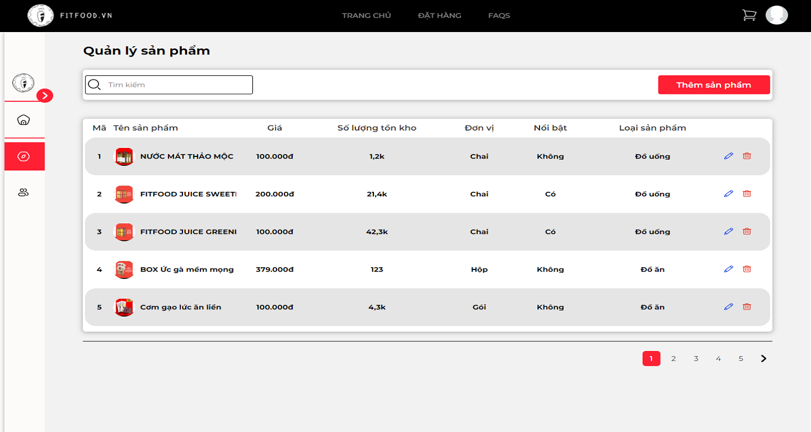 |
| :---------------------------------------------: |
|           Products Management Screen            |

</details>

and view more in [https://www.fitfood.kd14.me/](https://www.fitfood.kd14.me/)

## Creators

- <https://github.com/khanhduy-14>

## Thanks

Enjoy 🤘
